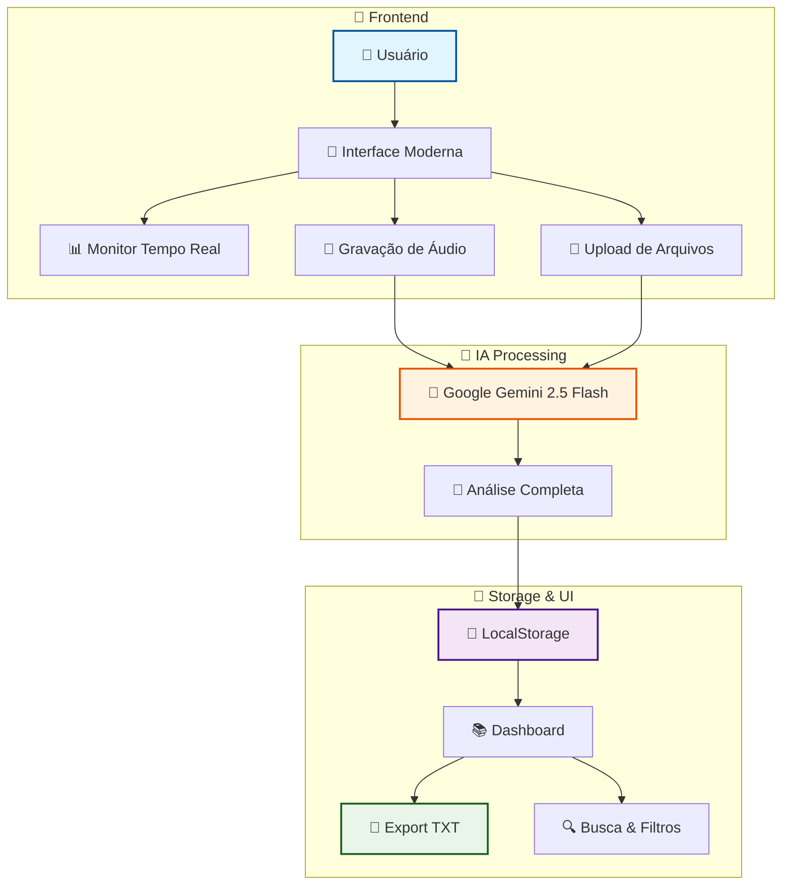
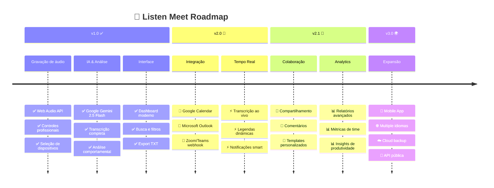

<div align="center">


[](https://git.io/typing-svg)

<p align="center">
  
  
  
  
</p>

<p align="center">
  
  
  
</p>

<p align="center">
  <a href="#-funcionalidades">✨ Features</a> •
  <a href="#-instalação">⚡ Install</a> •
  <a href="#-contribuição">🤝 Contribute</a>
</p>

</div>

---

## ✨ Preview e Funcionalidades

<div align="center">
  


|  **Gravação Inteligente** |  **IA Avançada** |  **Interface Moderna** |
|:---:|:---:|:---:|
|  |  |  |
| Gravação em tempo real<br/>Controles profissionais<br/>Teste de áudio | Transcrição automática<br/>Análise comportamental<br/>Insights inteligentes | Histórico organizado<br/>Busca avançada<br/>Export para TXT |

</div>

### 🎤 **Gravação Profissional**
```
🎙️ Monitoramento visual em tempo real
⚙️ Seleção de dispositivos de entrada  
⏯️ Controles de pause/play/stop
🧪 Teste de áudio antes da gravação
📁 Upload de arquivos (MP3, WAV, WEBM...)
🎚️ Múltiplos formatos de saída
```

### 🤖 **Análise Completa com IA**
```
🔤 Transcrição automática completa
📋 Resumo executivo inteligente
👥 Identificação de participantes
✅ Extração de ações e decisões
⏰ Timeline detalhada da reunião
📊 Métricas de produtividade
🎭 Análise de sentimento
🏷️ Categorização automática
```

### 📊 **Gestão Inteligente**
```
📚 Histórico completo organizado
🔍 Busca por conteúdo e participantes
📅 Filtros por período (hoje/semana/mês)
📈 Estatísticas consolidadas
📄 Export individual em TXT
💾 Armazenamento local seguro
```

---

## 🏗️ Arquitetura

<div align="center">



</div>

---

## 🛠️ Stack Tecnológica

<div align="center">

### Frontend & UI


### Audio & AI


### Storage & Tools


</div>

---

## ⚡ Instalação

<div align="center">

### 🚀 **3 Passos Simples**

</div>

<details>
<summary><b>📥 1. Clone o Repositório</b></summary>

```bash
# 🌟 Clone o projeto
git clone https://github.com/HigorGabs/listen-meet.git
cd listen-meet

# 📦 Instale as dependências
npm install
```

</details>

<details>
<summary><b>🔑 2. Configure Gemini API</b></summary>

```bash
# 🌐 Obtenha sua API Key gratuita
# https://makersuite.google.com/app/apikey

# ⚙️ Configure na primeira execução da app
# A chave é salva localmente no navegador
```

</details>

<details>
<summary><b>🎯 3. Execute o Projeto</b></summary>

```bash
# 🚀 Inicie o servidor de desenvolvimento
npm run dev

# 🌍 Acesse no navegador
# http://localhost:3000
```

</details>

<div align="center">

### 🎉 **Sem banco de dados • Sem autenticação • Sem configurações complexas!**

</div>

---

## 📊 O que a IA Analisa

<div align="center">


</div>

<details>
<summary><b>📋 Estrutura Completa da Análise</b></summary>

```json
{
  "title": "📝 Título sugerido da reunião",
  "summary": "📄 Resumo executivo conciso",
  "overview": "👁️ Visão geral detalhada",
  "keyPoints": ["🎯 Pontos principais identificados"],
  "actionItems": ["✅ Ações e próximos passos"],
  "participants": ["👥 Lista de participantes"],
  "topics": ["💬 Tópicos principais abordados"],
  "metrics": {
    "efficiency": "📊 Percentual de eficiência",
    "engagement": "🔥 Nível de engajamento",
    "decisionsCount": "⚡ Número de decisões tomadas"
  },
  "timeline": [
    {"phase": "⏰ Início", "description": "📝 O que aconteceu", "time": "🕐 0-5min"}
  ],
  "tags": {
    "meetingType": "🏷️ Planejamento/Review/Brainstorm",
    "priority": "⭐ Alta/Média/Baixa",
    "status": "✅ Concluída/Pendente"
  },
  "insights": {
    "sentiment": "😊 Tom geral da reunião",
    "engagement": "🎯 Nível de participação",
    "outcome": "🎁 Resultado obtido"
  },
  "participationAnalysis": [
    {
      "participant": "👤 Nome",
      "talkTime": "🕒 40%",
      "contributions": "💡 Tipo de contribuição",
      "role": "🎭 Papel na reunião"
    }
  ],
  "transcript": "📄 Transcrição completa"
}
```

</details>

---

## 🎯 Casos de Uso

<div align="center">

|  **Empresarial** |  **Acadêmico** |  **Pessoal** |
|:---:|:---:|:---:|
|  |  |  |
| Reuniões de equipe<br/>Brainstorming<br/>Negociações | Aulas e palestras<br/>Grupos de estudo<br/>Seminários | Entrevistas<br/>Podcasts<br/>Práticas |

</div>

---

## 🔧 Configuração Avançada

<details>
<summary><b>🍎 macOS - BlackHole Setup</b></summary>

```bash
# 📦 Instalar BlackHole
brew install blackhole-2ch

# ⚙️ Configurar no Audio MIDI Setup:
# 1. Criar Aggregate Device
# 2. Combinar microfone + BlackHole
# 3. Configurar Multi-Output Device
```

</details>

<details>
<summary><b>🪟 Windows - VB-Cable Setup</b></summary>

```bash
# 📥 Baixar VB-Audio Virtual Cable
# https://vb-audio.com/Cable/

# ⚙️ Configurar:
# 1. Instalar VB-Cable
# 2. Configurar como saída do sistema
# 3. Ativar "Escutar este dispositivo"
```

</details>

---

## 🔮 Roadmap

<div align="center">



</div>

---

## 🤝 Contribuição


<details>
<summary><b>🚀 Como Contribuir</b></summary>

1. **🍴 Fork** o projeto
2. **📥 Clone** sua fork: `git clone https://github.com/seu-usuario/listen-meet.git`
3. **🌿 Crie** uma branch: `git checkout -b feature/nova-funcionalidade`
4. **💻 Desenvolva** suas alterações
5. **🧪 Teste** tudo: `npm run build && npm run dev`
6. **💾 Commit**: `git commit -m "feat: adiciona nova funcionalidade"`
7. **📤 Push**: `git push origin feature/nova-funcionalidade`
8. **🔀 PR**: Abra um Pull Request

</details>

<details>
<summary><b>🎯 Áreas para Contribuição</b></summary>

- 🎨 **UI/UX**: Melhorias na interface
- 🤖 **IA**: Novos prompts e análises
- ⚡ **Performance**: Otimizações
- 🌐 **i18n**: Internacionalização
- 📱 **Mobile**: Responsividade
- 📖 **Docs**: Documentação

</details>

<details>
<summary><b>🐛 Reportar Bugs</b></summary>

Abra uma [issue](https://github.com/HigorGabs/listen-meet/issues) com:

- 🐛 **Descrição** clara do problema
- 🔄 **Passos** para reproduzir
- 🎯 **Comportamento** esperado vs atual
- 📱 **Ambiente** (OS, browser, versão)
- 📸 **Screenshots** se aplicável

</details>

---

## 📄 Licença

<div align="center">

Este projeto está sob a licença **MIT** - veja o arquivo [LICENSE](LICENSE) para detalhes.


</div>

---

## 👨‍💻 Autor

<div align="center">


**Desenvolvido com [❤️](https://github.com/HigorGabs)**

[](https://linkedin.com/in/higorgabs)
[](https://github.com/HigorGabs)
[](mailto:higorgabs@icloud.com)

</div>

---


<div align="center">


**⭐ Se este projeto foi útil, deixe uma estrela!**

[](https://github.com/HigorGabs/listen-meet/stargazers)
[](https://github.com/HigorGabs/listen-meet/network/members)

[🚀 **Demo ao Vivo**](https://listen-meet.vercel.app) • [🐛 **Reportar Bug**](https://github.com/HigorGabs/listen-meet/issues) • [💬 **Discussões**](https://github.com/HigorGabs/listen-meet/discussions)

**Transforme suas reuniões em insights acionáveis hoje mesmo! 🎤✨**

</div>
