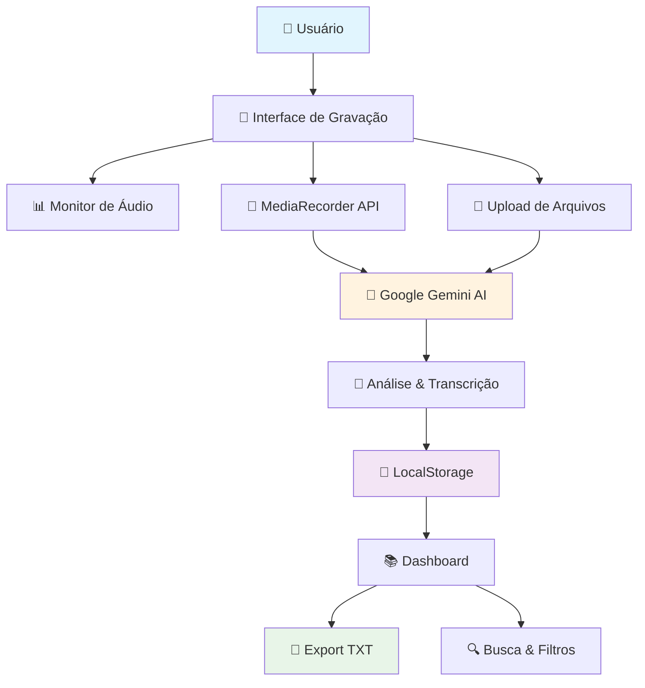

# 🎤 Listen Meet

> **Transforme suas reuniões em insights inteligentes com IA**

Uma aplicação moderna e intuitiva para gravar, transcrever e analisar reuniões usando o poder do Google Gemini AI. Capture áudio em tempo real, obtenha análises detalhadas e mantenha um histórico organizado de todas as suas reuniões.

<div align="center">

[](https://nextjs.org/)
[](https://www.typescriptlang.org/)
[](https://tailwindcss.com/)
[](https://ai.google.dev/)

</div>

## ✨ Funcionalidades Principais

### 🎯 **Gravação Inteligente de Áudio**
- **Gravação em tempo real** com controles profissionais (play, pause, stop)
- **Monitoramento visual** do nível de áudio com barras animadas
- **Seleção de dispositivos** de entrada (microfones, dispositivos virtuais)
- **Teste de áudio** antes da gravação para garantir qualidade
- **Upload de arquivos** existentes (MP3, WAV, WEBM, OGG, M4A)
- **Múltiplos formatos** de saída suportados

### 🤖 **Análise Completa com IA**
- **Transcrição automática** completa usando Google Gemini 2.5 Flash
- **Resumo executivo** inteligente com contexto e decisões
- **Identificação de participantes** automática ou manual
- **Extração de ações** e próximos passos
- **Timeline da reunião** com fases e marcos importantes
- **Métricas de produtividade** (eficiência, engajamento, decisões)
- **Análise de participação** individual com tempo de fala e contribuições
- **Categorização automática** (tipo, prioridade, status)
- **Insights comportamentais** (sentimento, urgência, resultados)

### 📊 **Dashboard e Gestão**
- **Histórico completo** de todas as reuniões
- **Interface expandível** com resumo e detalhes avançados
- **Busca inteligente** por conteúdo, participantes ou tópicos
- **Filtros por período** (hoje, esta semana, este mês)
- **Estatísticas consolidadas** (total de reuniões, tempo acumulado)
- **Export individual** em formato TXT para uso offline
- **Armazenamento local** seguro (sem necessidade de banco de dados)

### 🎨 **Interface Moderna**
- **Design responsivo** otimizado para desktop e mobile
- **Tema escuro/claro** automático baseado no sistema
- **Componentes elegantes** com Shadcn/UI e Radix primitives
- **Animações fluidas** e feedback visual intuitivo
- **Acessibilidade** otimizada com navegação por teclado
- **Tooltips informativos** e ajuda contextual

## 🏗️ Arquitetura Técnica



## 🔄 Fluxo da Aplicação

```mermaid
flowchart LR
    Start([🚀 Iniciar]) --> Setup{🔧 API Configurada?}
    Setup -->|Não| Config[⚙️ Configurar Gemini API]
    Setup -->|Sim| Choose{📝 Escolher Ação}
    Config --> Choose
    
    Choose -->|Gravar| Record[🎤 Iniciar Gravação]
    Choose -->|Upload| Upload[📁 Upload Arquivo]
    Choose -->|Histórico| History[📚 Ver Histórico]
    
    Record --> Monitor[📊 Monitor Tempo Real]
    Monitor --> Controls[⏸️ Controles de Gravação]
    Controls --> Stop[⏹️ Finalizar]
    
    Upload --> Process[🤖 Processar com IA]
    Stop --> Process
    
    Process --> Analysis[📋 Análise Completa]
    Analysis --> Save[💾 Salvar Local]
    Save --> Download[⬇️ Auto Download TXT]
    Download --> History
    
    History --> Details[📄 Ver Detalhes]
    Details --> Search[🔍 Buscar & Filtrar]
    Details --> Export[📤 Exportar TXT]
    
    style Start fill:#81c784
    style Process fill:#ffb74d
    style Analysis fill:#9575cd
    style Save fill:#4fc3f7
```



## 🛠️ Stack Tecnológica

### **Frontend & UI**
- **Next.js 15** - Framework React com App Router e Turbopack
- **TypeScript** - Tipagem estática para maior robustez
- **Tailwind CSS** - Estilização utilitária e responsiva
- **Shadcn/UI** - Componentes elegantes e acessíveis
- **Radix UI** - Primitives para componentes complexos
- **Lucide React** - Ícones modernos e consistentes

### **Gravação & Áudio**
- **Web Audio API** - Monitoramento em tempo real
- **MediaRecorder API** - Gravação nativa do navegador
- **MediaDevices API** - Seleção de dispositivos
- **AnalyserNode** - Análise de frequência e nível

### **Inteligência Artificial**
- **Google Gemini 2.5 Flash** - Transcrição e análise de áudio
- **Generative AI SDK** - Integração oficial do Google

### **Armazenamento & Dados**
- **LocalStorage** - Persistência local sem servidor
- **Blob API** - Manipulação de arquivos de áudio
- **File API** - Upload e processamento de arquivos
- **JSON** - Estrutura de dados para reuniões

## 📋 Pré-requisitos

- **Node.js** 18+ ([Download](https://nodejs.org/))
- **NPM** ou **Yarn** para gerenciamento de pacotes
- **Google Gemini API Key** ([Obter grátis](https://makersuite.google.com/app/apikey))
- **Navegador moderno** com suporte a:
  - MediaRecorder API
  - Web Audio API
  - LocalStorage
  - ES2020+

> **🎉 Super Simples:** Não precisa de banco de dados, autenticação, servidor backend ou configurações complexas!

## ⚡ Instalação e Configuração

### 1. **Clone e Configure**

```bash
# Clone o repositório
git clone https://github.com/seu-usuario/listen-meet.git
cd listen-meet

# Instale as dependências
npm install

# Execute em modo desenvolvimento
npm run dev
```

### 2. **Configure a API Key**

1. Acesse [Google AI Studio](https://makersuite.google.com/app/apikey)
2. Crie um novo projeto (gratuito)
3. Gere uma API Key
4. Na primeira execução da aplicação, configure a chave

### 3. **Acesse a Aplicação**

```
http://localhost:3000
```

## 🎯 Guia de Uso

### **1. Configuração Inicial**
- Abra a aplicação no navegador
- Configure sua API Key do Gemini (primeira vez)
- Teste a configuração para validar

### **2. Gravação Básica**
- Clique em "Iniciar Gravação"
- Permita acesso ao microfone
- Use os controles (pause/play/stop)
- A análise inicia automaticamente ao parar

### **3. Configuração Avançada de Áudio**
Para capturar áudio completo de reuniões online:

#### **macOS (BlackHole)**
```bash
# Instalar BlackHole
brew install blackhole-2ch
```
1. Configure Aggregate Device no Audio MIDI Setup
2. Combine seu microfone + BlackHole
3. Configure Multi-Output para seus fones + BlackHole

#### **Windows (VB-Cable)**
1. Baixe e instale VB-Audio Virtual Cable
2. Configure como dispositivo de saída do sistema
3. Ative "Escutar este dispositivo"

### **4. Upload de Arquivos**
- Clique em "Upload de Arquivo"
- Selecione arquivo de áudio (MP3, WAV, etc.)
- Aguarde processamento automático

### **5. Gestão do Histórico**
- Acesse aba "Histórico"
- Use busca para encontrar reuniões
- Filtre por período
- Expanda para ver análise completa
- Exporte para TXT quando necessário

## 📊 O que a IA Analisa

### **Estrutura da Análise**
```json
{
  "title": "Título sugerido da reunião",
  "summary": "Resumo executivo conciso",
  "overview": "Visão geral detalhada",
  "keyPoints": ["Pontos principais identificados"],
  "actionItems": ["Ações e próximos passos"],
  "participants": ["Lista de participantes"],
  "topics": ["Tópicos principais abordados"],
  "metrics": {
    "efficiency": "Percentual de eficiência",
    "engagement": "Nível de engajamento",
    "decisionsCount": "Número de decisões tomadas"
  },
  "timeline": [
    {"phase": "Início", "description": "O que aconteceu", "time": "0-5min"}
  ],
  "tags": {
    "meetingType": "Planejamento/Review/Brainstorm",
    "priority": "Alta/Média/Baixa",
    "status": "Concluída/Pendente"
  },
  "insights": {
    "sentiment": "Tom geral da reunião",
    "engagement": "Nível de participação",
    "outcome": "Resultado obtido"
  },
  "participationAnalysis": [
    {
      "participant": "Nome",
      "talkTime": "40%",
      "contributions": "Tipo de contribuição",
      "role": "Papel na reunião"
    }
  ],
  "transcript": "Transcrição completa"
}
```

## 🔧 Configurações Avançadas

### **Personalização de Dispositivos**
- Selecione microfone específico
- Configure dispositivos virtuais para captura completa
- Teste níveis de áudio antes da gravação

### **Otimização de Performance**
- A aplicação usa LocalStorage (sem limite rígido)
- Arquivos de áudio são processados e descartados
- Apenas metadados e análises são mantidos

### **Segurança e Privacidade**
- Todos os dados ficam no seu navegador
- API Key armazenada localmente
- Áudio enviado apenas para processamento (não armazenado)
- Sem rastreamento ou coleta de dados

## 🎯 Casos de Uso

### **Empresarial**
- 📋 Reuniões de equipe e alinhamentos
- 🎯 Sessões de brainstorming
- 📊 Reuniões de planejamento estratégico
- 🤝 Negociações e acordos comerciais
- 📈 Reviews e retrospectivas

### **Acadêmico**
- 🎓 Aulas e palestras
- 👥 Grupos de estudo
- 📚 Seminários e workshops
- 🔬 Reuniões de pesquisa
- 📝 Entrevistas acadêmicas

### **Pessoal**
- 💡 Entrevistas e podcasts
- 📝 Notas de voz organizadas
- 🗣️ Práticas de apresentação
- 📞 Calls importantes
- 🎤 Gravações criativas

## 🔮 Tecnologias e Funcionalidades

### **Gravação de Áudio**
- ✅ Seleção de dispositivo de entrada
- ✅ Monitoramento visual em tempo real
- ✅ Controles de pausa/retomada
- ✅ Teste de áudio antes da gravação
- ✅ Suporte a múltiplos formatos
- ✅ Upload de arquivos existentes

### **Processamento com IA**
- ✅ Transcrição completa e precisa
- ✅ Resumo executivo inteligente
- ✅ Identificação de participantes
- ✅ Extração de ações e decisões
- ✅ Timeline detalhada da reunião
- ✅ Métricas de eficiência
- ✅ Análise de sentimento
- ✅ Categorização automática
- ✅ Insights comportamentais

### **Interface e Usabilidade**
- ✅ Design responsivo e moderno
- ✅ Tema escuro/claro automático
- ✅ Navegação intuitiva
- ✅ Busca e filtros avançados
- ✅ Export para TXT
- ✅ Tooltips e ajuda contextual

## 🤝 Contribuição

Contribuições são sempre bem-vindas! 

### **Como Contribuir**
1. **Fork** o projeto
2. **Clone** sua fork: `git clone https://github.com/seu-usuario/listen-meet.git`
3. **Crie** uma branch: `git checkout -b feature/nova-funcionalidade`
4. **Faça** suas alterações
5. **Teste** tudo funcionando: `npm run build && npm run dev`
6. **Commit**: `git commit -m "feat: adiciona nova funcionalidade"`
7. **Push**: `git push origin feature/nova-funcionalidade`
8. **Abra** um Pull Request

### **Áreas para Contribuição**
- 🎨 Melhorias na interface
- 🤖 Novos prompts para IA
- 🔧 Otimizações de performance
- 📱 Responsividade mobile
- 🌐 Internacionalização
- 📖 Documentação

### **Reportar Bugs**
Abra uma [issue](https://github.com/seu-usuario/listen-meet/issues) com:
- 🐛 Descrição clara do problema
- 🔄 Passos para reproduzir
- 🎯 Comportamento esperado vs atual
- 📱 Informações do ambiente (OS, browser, versão)
- 📸 Screenshots se aplicável

## 📄 Licença

Este projeto está sob a licença **MIT**. Veja o arquivo [LICENSE](LICENSE) para mais detalhes.

## 👨‍💻 Autor

**Desenvolvido com ❤️ por Higor**

- 🌐 [Website](https://seu-website.com)
- 💼 [LinkedIn](https://linkedin.com/in/seu-perfil)  
- 🐙 [GitHub](https://github.com/seu-usuario)
- 📧 [Email](mailto:seu-email@exemplo.com)

## 🙏 Agradecimentos

- **Google** pelo poderoso Gemini AI
- **Vercel** pelo incrível Next.js
- **Shadcn** pelos componentes UI elegantes
- **Radix UI** pelos primitives acessíveis
- **Tailwind** pelo sistema de design
- **Comunidade Open Source** pelo apoio constante

---

<div align="center">

**⭐ Se este projeto foi útil, deixe uma estrela!**

[🚀 Demo ao Vivo](https://listen-meet.vercel.app) • [🐛 Reportar Bug](https://github.com/seu-usuario/listen-meet/issues) • [💬 Discussões](https://github.com/seu-usuario/listen-meet/discussions) • [📖 Wiki](https://github.com/seu-usuario/listen-meet/wiki)

**Transforme suas reuniões em insights acionáveis hoje mesmo! 🎤✨**

</div>