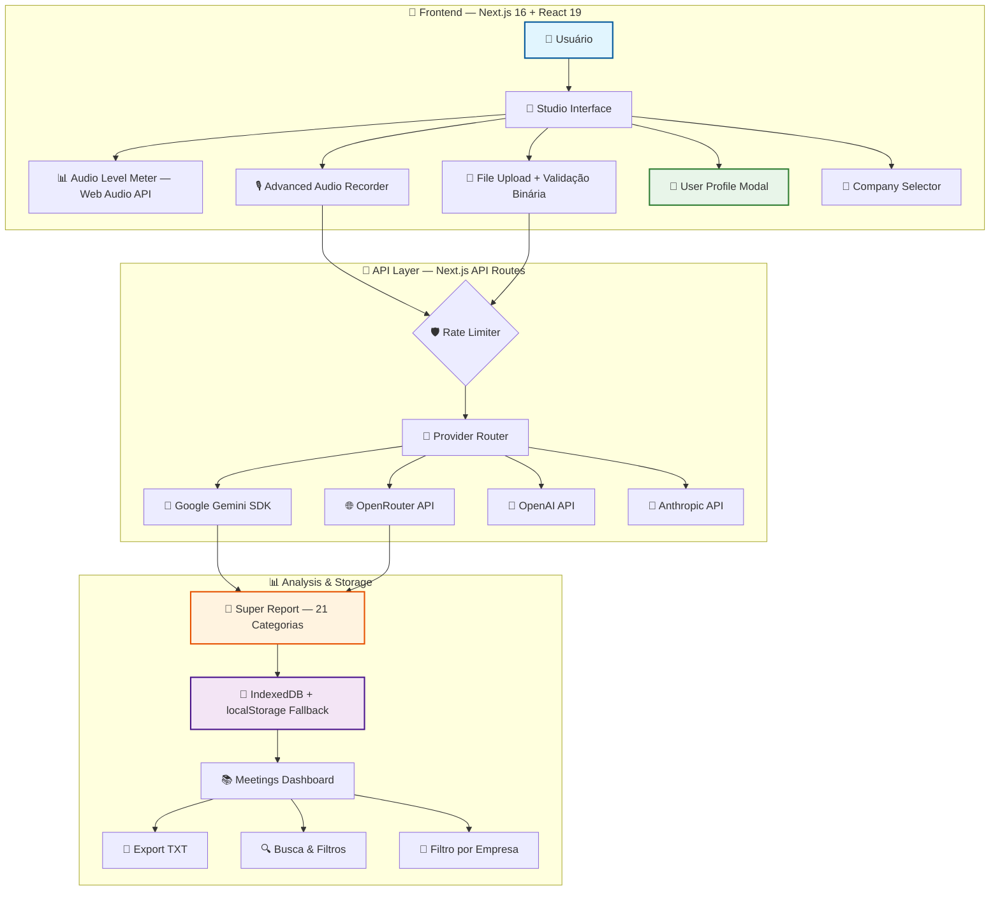
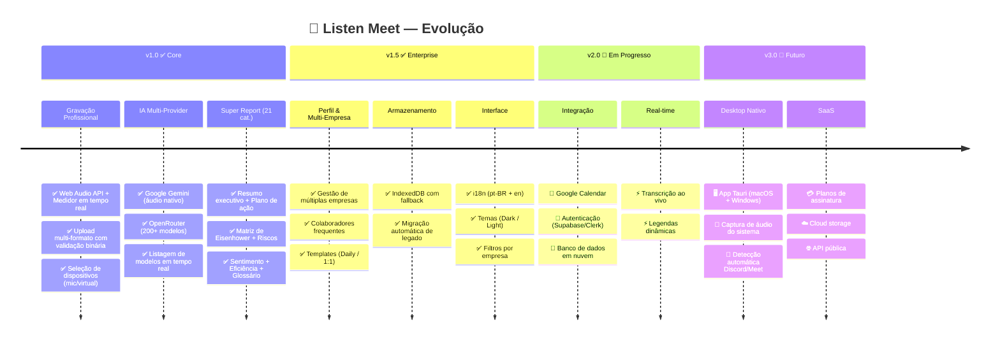

<div align="center">


[](https://git.io/typing-svg)

<p align="center">
  
  
  
  
  
</p>

<p align="center">
  
  
  
</p>

<p align="center">
  <a href="#-funcionalidades-principais">✨ Features</a> •
  <a href="#-super-report-21-categorias-de-análise">🧠 Super Report</a> •
  <a href="#-instalação">⚡ Install</a> •
  <a href="#-arquitetura">🏗️ Arquitetura</a> •
  <a href="#-contribuição">🤝 Contribute</a>
</p>

</div>

---

## ✨ Funcionalidades Principais

<div align="center">

| 🎤 **Gravação Pro** | 🤖 **IA Multi-Provider** | 📊 **Super Report (21 categorias)** | 👤 **Perfil & Empresas** |
|:---:|:---:|:---:|:---:|
| Gravação em tempo real<br/>Medidor de sinal ao vivo<br/>Upload de áudio<br/>Teste pré-gravação | Gemini · OpenRouter<br/>OpenAI · Anthropic<br/>Listagem de modelos em tempo real<br/>Fallback automático | Resumo executivo<br/>Plano de ação completo<br/>Matriz de Eisenhower<br/>Análise de sentimento | Multi-empresa<br/>Colaboradores frequentes<br/>Templates de reunião<br/>Reconhecimento de voz por nome |

</div>

### 🎤 Gravação Profissional de Áudio

- **Monitoramento visual em tempo real** — Medidor de nível com espectro de captação, indicadores de presença e silêncio
- **Seleção granular de dispositivos** — Microfone físico, dispositivo virtual (BlackHole/VB-Cable) ou upload direto
- **Controles de sessão** — Play, pause, resume, stop com timer de duração
- **Teste de áudio** — Validação do sinal antes de gravar reuniões reais
- **Upload direto** — MP3, WAV, WEBM, OGG, AAC, M4A, FLAC (limite configurável por provedor, até 25MB)
- **Validação de assinatura binária** — Detecção real do formato do arquivo para segurança

### 🤖 IA Multi-Provider com Seleção Inteligente

```
┌─ Google Gemini (Nível S) ──── Processamento nativo de áudio · 1M+ tokens de contexto
├─ OpenRouter ──────────────── Gateway unificado com 200+ modelos · Processamento de áudio
├─ OpenAI ──────────────────── Listagem de modelos ativa · Expansão futura
└─ Anthropic ───────────────── Listagem de modelos ativa · Expansão futura
```

- **Listagem de modelos em tempo real** para cada provedor
- **Fallback automático** entre modelos Gemini configuráveis
- **Chave via servidor** (`.env.local`) ou **chave da sessão** do navegador
- **Rate limiting** por IP para proteção em produção
- **Limites de upload por provedor** — Gemini 25MB · OpenRouter 15MB · OpenAI/Anthropic 10MB
- **Dois modos de processamento:**
  - 🎵 **Multimodal** — Áudio enviado diretamente para a IA (nativo, mais preciso)
  - 📝 **Texto** — Áudio → Transcrição → Análise textual (2 passos, compatível com mais modelos)
- **Compressão inteligente** — Downsampling client-side (16kHz/8kHz mono WAV) para arquivos grandes
- **Sistema de avaliação de provedores** — Notas S/A+/B+/B com prós e contras por provider

### 👤 Perfil de Usuário & Gestão Multi-Empresa

- **Perfil completo** — Nome, avatar (upload com compressão ou gradiente), cargo por empresa
- **Múltiplas empresas/projetos** — Cadastre empresas e associe reuniões a cada uma
- **Colaboradores frequentes** — Cadastre nomes e cargos das pessoas com quem você mais reúne
- **Identificação inteligente de voz** — A IA utiliza o perfil e os colaboradores para mapear automaticamente os falantes no áudio
- **Templates de reunião** — Default, Daily Scrum ou 1:1 Feedback com prompts especializados
- **Contexto customizado** — Adicione título, contexto e empresa a cada gravação para enriquecer a análise

### 🌐 Internacionalização (i18n)

- **Português (pt-BR)** e **Inglês (en)** totalmente traduzidos
- Troca de idioma instantânea via interface
- Todos os textos, labels, tooltips e mensagens de erro são localizados

---

## 🧠 Super Report: 21 Categorias de Análise

O Listen Meet gera um relatório completo e estruturado com **21 categorias de análise** por reunião, extraídas automaticamente pela IA:

<details>
<summary><b>📋 Ver todas as 21 categorias do relatório</b></summary>

| # | Categoria | Descrição |
|:---:|:---|:---|
| 1 | **Resumo em 1 Linha** | Sentença marcante resumindo a reunião |
| 2 | **Visão Geral** | Overview detalhado em 2-3 parágrafos |
| 3 | **Pontos Principais** | Destaques identificados na discussão |
| 4 | **Plano de Ação** | Tarefas com responsável, prazo e prioridade |
| 5 | **Decisões Críticas** | Decisões tomadas com racional/justificativa |
| 6 | **Riscos & Bloqueios** | Impedimentos com impacto e mitigação |
| 7 | **Análise de Participação** | Talk time, contribuições e papel de cada participante |
| 8 | **Alinhamento de Agenda** | Objetivos alcançados vs. pendentes |
| 9 | **Timeline da Reunião** | Fases cronológicas com descrição |
| 10 | **Sentimento Geral** | Análise emocional do grupo (empolgado, focado, tenso) |
| 11 | **Timeline de Sentimento** | Variação do humor por fase |
| 12 | **Métricas Conversacionais** | Tempo de silêncio, velocidade e pausas |
| 13 | **Análise de Eficiência** | Score de foco da pauta + % de desvios |
| 14 | **Energia & Humor** | Variação da energia (início → pico → final) |
| 15 | **Matriz de Eisenhower** | Priorização: Urgente/Importante para cada ação |
| 16 | **Consenso & Divergências** | Nível de concordância + pontos de debate |
| 17 | **Glossário Técnico** | Termos, siglas e jargões explicados |
| 18 | **Ferramentas Mencionadas** | Softwares e sistemas citados com contexto |
| 19 | **Perguntas em Aberto** | Questões sem resposta que precisam de follow-up |
| 20 | **Próxima Pauta Sugerida** | Agenda recomendada para o próximo encontro |
| 21 | **Desenvolvimento Individual** | Feedback construtivo para cada participante |

</details>

<details>
<summary><b>📊 Métricas de Produtividade</b></summary>

- **Meeting Quality Score** — Nota de 0-100 para qualidade geral
- **Eficiência** — Percentual de tempo produtivo
- **Engajamento** — Nível de participação ativa
- **Contagem de Decisões** — Decisões tomadas na reunião
- **Distribuição de Tópicos** — Breakdown percentual por tema discutido
- **Citações & Highlights** — Frases impactantes extraídas literalmente

</details>

<details>
<summary><b>🏷️ Templates Especializados</b></summary>

#### Daily Scrum
Prompt otimizado para standup meetings com foco nos 3 pilares:
- O que cada pessoa **fez ontem**
- O que cada pessoa **vai fazer hoje**
- Quais **impedimentos** existem

#### 1:1 Feedback
Prompt otimizado para reuniões one-on-one com foco em:
- Alinhamento entre colaborador e gestor
- Metas e desenvolvimento profissional
- Feedback individual detalhado

</details>

---

## 📚 Gestão Inteligente de Reuniões

- **Armazenamento robusto** — IndexedDB como storage primário com fallback automático para localStorage
- **Migração transparente** — Dados legados são migrados automaticamente para IndexedDB
- **Histórico completo** — Até 50 reuniões armazenadas localmente
- **Busca full-text** — Busque por conteúdo, participantes, tópicos, empresas
- **Filtros temporais** — Hoje, esta semana, este mês, todas
- **Filtro por empresa** — Visualize reuniões segregadas por empresa/projeto
- **Visão "Eu"** — Identifique-se no perfil e veja suas tarefas pessoais destacadas
- **Dashboard vs Reader** — Alterne entre visão resumida (cards) e leitura completa do relatório

### 🎧 Player de Áudio Integrado

- **Reprodução embutida** — Ouça a gravação direto no dashboard
- **Controle de velocidade** — 0.5x, 1x, 1.5x, 2x
- **Seek e pular** — Avance/retroceda ±10 segundos

### ✅ Gerenciamento Pós-Reunião

- **Checklist de ações** — Marque itens como concluídos (estado persistido)
- **Edição de participantes** — Renomeie, adicione ou remova participantes após o processamento
- **"Marcar como Eu"** — Identifique-se para ver suas tarefas pessoais destacadas
- **Renomear reunião** — Altere título e empresa vinculada a qualquer momento
- **Visibilidade de seções** — Mostre/oculte/collapse seções do relatório, com preferência persistida

### 📤 Exportação Multi-Formato

- **TXT** — Relatório completo em texto puro
- **Markdown** — Formatação rica para documentação
- **HTML** — Pronto para email ou publicação
- **Copiar para clipboard** — Cole direto em qualquer aplicação
- **Imprimir** — Layout otimizado para impressão
- **Export em lote** — Exporte todas as reuniões de uma vez

### 🔗 Integrações de Produtividade

- **Notion** — Sincronize atas e ações para páginas do Notion
- **Slack** — Envie resumos via webhook para canais do Slack
- **Jira Cloud** — Crie tasks automaticamente a partir das ações da reunião

---

## 🏗️ Arquitetura

<div align="center">


```mermaid
graph TB
    subgraph "🎤 Frontend — Next.js 16 + React 19"
        A[👤 Usuário] --> B[🎯 Studio Interface]
        B --> C[📊 Audio Level Meter — Web Audio API]
        B --> D[🎙️ Advanced Audio Recorder]
        B --> E[📁 File Upload + Validação Binária]
        B --> N[👤 User Profile Modal]
        B --> O[🏢 Company Selector]
    end

    subgraph "🔧 API Layer — Next.js API Routes"
        D --> F{🛡️ Rate Limiter}
        E --> F
        F --> G[🔀 Provider Router]
        G --> H[🧠 Google Gemini SDK]
        G --> I[🌐 OpenRouter API]
        G --> J[🤖 OpenAI API]
        G --> K[💬 Anthropic API]
    end

    subgraph "📊 Analysis & Storage"
        H --> L[📝 Super Report — 21 Categorias]
        I --> L
        L --> M[💾 IndexedDB + localStorage Fallback]
        M --> P[📚 Meetings Dashboard]
        P --> Q[📄 Export TXT]
        P --> R[🔍 Busca & Filtros]
        P --> S[🏢 Filtro por Empresa]
    end

    style A fill:#e1f5fe,stroke:#01579b,stroke-width:2px
    style L fill:#fff3e0,stroke:#e65100,stroke-width:2px
    style M fill:#f3e5f5,stroke:#4a148c,stroke-width:2px
    style N fill:#e8f5e9,stroke:#2e7d32,stroke-width:2px
```

</div>

### 📁 Estrutura do Projeto

```
src/
├── app/
│   ├── page.tsx                          # Página principal — Studio de gravação
│   ├── layout.tsx                        # Root layout com metadata e fonts
│   ├── globals.css                       # Estilos globais + design system
│   └── api/
│       ├── process-audio/route.ts        # POST — Processamento de áudio (multi-provider)
│       ├── models/route.ts               # GET  — Listagem de modelos por provedor
│       └── test-gemini/route.ts          # GET  — Health check da API Gemini
│
├── components/
│   ├── AdvancedAudioRecorder.tsx          # Gravador profissional com Web Audio API
│   ├── AudioLevelMeter.tsx               # Medidor de nível em tempo real com espectro
│   ├── AudioSetupModal.tsx               # Guia de configuração de dispositivos virtuais
│   ├── MeetingsList.tsx                  # Dashboard de reuniões (200KB+ de UI rica)
│   ├── SessionReadinessPanel.tsx         # Painel de checklist e prontidão
│   ├── StudioCommandRail.tsx             # Barra lateral de controles do estúdio
│   ├── UserProfileModal.tsx              # Modal de perfil, empresas e colaboradores
│   └── ui/                              # Primitivos Radix UI (15 componentes)
│       ├── alert.tsx, badge.tsx, button.tsx, card.tsx
│       ├── dialog.tsx, dropdown-menu.tsx, input.tsx
│       ├── label.tsx, material-icon.tsx, progress.tsx
│       ├── select.tsx, tabs.tsx, textarea.tsx
│       └── tooltip.tsx
│
├── hooks/
│   └── useAdvancedAudioRecorder.ts        # Web Audio API hook (compressão + downsampling)
│
├── lib/
│   ├── ai-providers.ts                   # Config de 4 provedores + fallback inteligente
│   ├── audio-constraints.ts              # Validação de formato + assinatura binária
│   ├── i18n.ts                           # Sistema completo de i18n (pt-BR + en)
│   ├── meeting-summary.ts               # Schema Zod (21 categorias) + exportação TXT
│   ├── profile.ts                        # Tipos e persistência de perfil/empresa
│   ├── rate-limit.ts                     # Rate limiter por IP
│   ├── studio-theme.ts                   # Sistema de temas (dark/light)
│   └── utils.ts                          # Utilitários (cn para merge de classes)
│
└── utils/
    └── storage.ts                        # MeetingStorage — IndexedDB + localStorage
```

---

## 🛠️ Stack Tecnológica

<div align="center">

### Core


### UI Components


### AI & Audio


### Validation & Storage


### Testing & Deploy


</div>

---

## ⚡ Instalação

<div align="center">

### 🚀 **3 Passos Simples**

</div>

<details>
<summary><b>📥 1. Clone o Repositório</b></summary>

```bash
# 🌟 Clone o projeto
git clone https://github.com/username/listen-meet.git
cd listen-meet

# 📦 Instale as dependências
npm install
```

</details>

<details>
<summary><b>🧰 Pré-requisitos</b></summary>

```bash
# Next.js 16 exige Node moderno.
# Recomendado:
nvm use

# Mínimo aceito pelo projeto:
node --version # >= 20.9.0
```

</details>

<details>
<summary><b>🔑 2. Configure a IA</b></summary>

```bash
# 🌐 Obtenha sua API Key gratuita
# https://makersuite.google.com/app/apikey

# ✅ Copie o arquivo de exemplo:
cp .env.example .env.local

# Edite .env.local:
GEMINI_API_KEY=sua-chave-do-gemini
GEMINI_MODEL=gemini-flash-latest
GEMINI_FALLBACK_MODELS=gemini-3.5-flash,gemini-2.5-flash,gemini-2.5-flash-lite

# Provedores adicionais (opcionais):
OPENROUTER_API_KEY=
OPENROUTER_MODEL=
OPENAI_API_KEY=
OPENAI_MODEL=
ANTHROPIC_API_KEY=
ANTHROPIC_MODEL=

# URL pública (para referrer do OpenRouter):
NEXT_PUBLIC_APP_URL=http://localhost:3000

# Produção — desative chaves do servidor para segurança:
LISTEN_MEET_ALLOW_SERVER_KEYS=false

# Proxy reverso (Cloudflare, Nginx, etc.):
LISTEN_MEET_TRUST_PROXY_HEADERS=false
```

> **Alternativa:** Na tela inicial, escolha "Minha chave", informe a API key e selecione o modelo.
> A chave fica apenas na sessão do navegador e não é persistida.

</details>

<details>
<summary><b>🎯 3. Execute o Projeto</b></summary>

```bash
# 🚀 Inicie o servidor de desenvolvimento
npm run dev

# 🌍 Acesse no navegador
# http://localhost:3000
```

</details>

<details>
<summary><b>🧪 Scripts Disponíveis</b></summary>

```bash
npm run dev         # Servidor de desenvolvimento (Turbopack)
npm run build       # Build de produção
npm run start       # Servidor de produção
npm run lint        # ESLint
npm run typecheck   # TypeScript strict
npm run test        # Vitest (unit tests)
npm run verify      # lint + typecheck + test + build (CI pipeline)
```

</details>

<div align="center">

### 🎉 **Sem banco de dados externo • Sem autenticação obrigatória • Zero config para começar!**

</div>

---

## 🔐 Privacidade e Segurança

| Aspecto | Comportamento |
|:---|:---|
| **Chaves de API** | Preferencialmente no servidor (`.env.local`). Chaves da sessão ficam apenas em memória. |
| **Produção** | `LISTEN_MEET_ALLOW_SERVER_KEYS=false` por padrão — impede uso público da quota do servidor. |
| **Armazenamento** | IndexedDB local no navegador. Sem sincronização remota. |
| **Rate Limiting** | Limite de requisições por IP na API de processamento. |
| **Validação de Áudio** | Checagem de extensão, MIME type e assinatura binária dos bytes do arquivo. |
| **Consentimento** | O app inclui guia explícito de privacidade e aviso para informar participantes antes de gravar. |

---

## 🔧 Configuração Avançada de Áudio

<details>
<summary><b>🍎 macOS — BlackHole Setup</b></summary>

```bash
# 📦 Instalar BlackHole
brew install blackhole-2ch

# ⚙️ Configurar no Audio MIDI Setup:
# 1. Criar Aggregate Device (Mic + BlackHole)
# 2. Criar Multi-Output Device (Fones + BlackHole)
# 3. Selecionar Aggregate Device como entrada no Listen Meet
```

</details>

<details>
<summary><b>🪟 Windows — VB-Cable Setup</b></summary>

```bash
# 📥 Baixar VB-Audio Virtual Cable
# https://vb-audio.com/Cable/

# ⚙️ Configurar:
# 1. Instalar VB-Cable
# 2. Configurar CABLE Input como saída do sistema
# 3. No Listen Meet, selecionar CABLE Output como entrada
```

</details>

---

## 🎯 Casos de Uso

<div align="center">

| 🏢 **Empresarial** | 🎓 **Acadêmico** | 💼 **Pessoal** |
|:---:|:---:|:---:|
| Daily Scrums<br/>Planning & Review<br/>1:1 Feedback<br/>Brainstorming | Aulas e palestras<br/>Seminários<br/>Defesas de TCC<br/>Grupos de estudo | Entrevistas<br/>Podcasts<br/>Mentorias<br/>Consultorias |

</div>

---

## 🔮 Roadmap

<div align="center">


```mermaid
timeline
    title 🚀 Listen Meet — Evolução

    section v1.0 ✅ Core
        Gravação Profissional    : ✅ Web Audio API + Medidor em tempo real
                                  : ✅ Upload multi-formato com validação binária
                                  : ✅ Seleção de dispositivos (mic/virtual)

        IA Multi-Provider        : ✅ Google Gemini (áudio nativo)
                                  : ✅ OpenRouter (200+ modelos)
                                  : ✅ Listagem de modelos em tempo real

        Super Report (21 cat.)   : ✅ Resumo executivo + Plano de ação
                                  : ✅ Matriz de Eisenhower + Riscos
                                  : ✅ Sentimento + Eficiência + Glossário

    section v1.5 ✅ Enterprise
        Perfil & Multi-Empresa   : ✅ Gestão de múltiplas empresas
                                  : ✅ Colaboradores frequentes
                                  : ✅ Templates (Daily / 1:1)

        Armazenamento            : ✅ IndexedDB com fallback
                                  : ✅ Migração automática de legado

        Interface                : ✅ i18n (pt-BR + en)
                                  : ✅ Temas (Dark / Light)
                                  : ✅ Filtros por empresa

    section v2.0 🔄 Em Progresso
        Integração               : 📅 Google Calendar
                                  : 📅 Autenticação (Supabase/Clerk)
                                  : 📅 Banco de dados em nuvem

        Real-time                : ⚡ Transcrição ao vivo
                                  : ⚡ Legendas dinâmicas

    section v3.0 🌟 Futuro
        Desktop Nativo           : 🖥️ App Tauri (macOS + Windows)
                                  : 🎤 Captura de áudio do sistema
                                  : 🔗 Detecção automática Discord/Meet

        SaaS                     : 💳 Planos de assinatura
                                  : ☁️ Cloud storage
                                  : 🌐 API pública
```

</div>

---

## 🤝 Contribuição

<details>
<summary><b>🚀 Como Contribuir</b></summary>

1. **🍴 Fork** o projeto
2. **📥 Clone** sua fork: `git clone https://github.com/seu-usuario/listen-meet.git`
3. **🌿 Crie** uma branch: `git checkout -b feature/nova-funcionalidade`
4. **💻 Desenvolva** suas alterações
5. **🧪 Valide** tudo: `npm run verify`
6. **💾 Commit**: `git commit -m "feat: adiciona nova funcionalidade"`
7. **📤 Push**: `git push origin feature/nova-funcionalidade`
8. **🔀 PR**: Abra um Pull Request

</details>

<details>
<summary><b>🎯 Áreas para Contribuição</b></summary>

- 🎨 **UI/UX** — Melhorias na interface e experiência
- 🤖 **IA** — Novos providers, prompts e análises
- ⚡ **Performance** — Otimizações de build e runtime
- 🌐 **i18n** — Novos idiomas (es, fr, de...)
- 🧪 **Testes** — Cobertura de componentes e APIs
- 📖 **Docs** — Documentação e guias

</details>

<details>
<summary><b>🐛 Reportar Bugs</b></summary>

Abra uma [issue](https://github.com/HigorGabs/listen-meet/issues) com:

- 🐛 **Descrição** clara do problema
- 🔄 **Passos** para reproduzir
- 🎯 **Comportamento** esperado vs atual
- 📱 **Ambiente** (OS, browser, versão do Node)
- 📸 **Screenshots** se aplicável

</details>

---

## 📄 Licença

<div align="center">

Este projeto está sob a licença **MIT** — veja o arquivo [LICENSE](LICENSE) para detalhes.


</div>

---

## 👨‍💻 Autor

<div align="center">

<div style="font-size: 60px; font-weight: bold; background: linear-gradient(to right, #818CF8, #C084FC); -webkit-background-clip: text; -webkit-text-fill-color: transparent; margin: 10px 0;">H</div>

**Desenvolvido com [❤️](https://github.com/username)**

[](https://linkedin.com/in/username)
[](https://github.com/username)
[](mailto:contact@example.com)

</div>

---

<div align="center">


**⭐ Se este projeto foi útil, deixe uma estrela!**

[](https://github.com/username/listen-meet/stargazers)
[](https://github.com/username/listen-meet/network/members)

[🚀 **Demo ao Vivo**](https://listen-meet.vercel.app) • [🐛 **Reportar Bug**](https://github.com/username/listen-meet/issues) • [💬 **Discussões**](https://github.com/username/listen-meet/discussions)

**Transforme suas reuniões em inteligência acionável! 🎤🧠✨**

</div>
